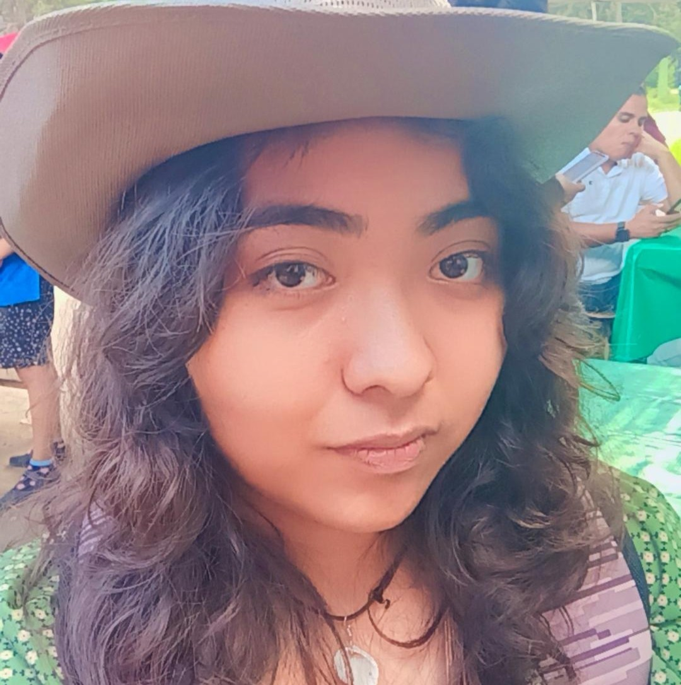
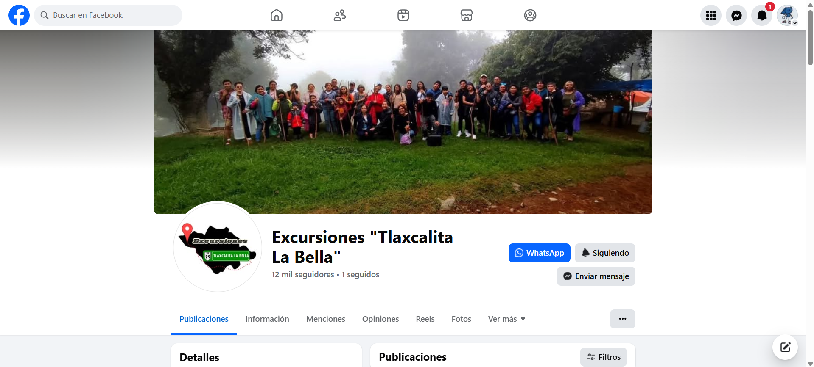
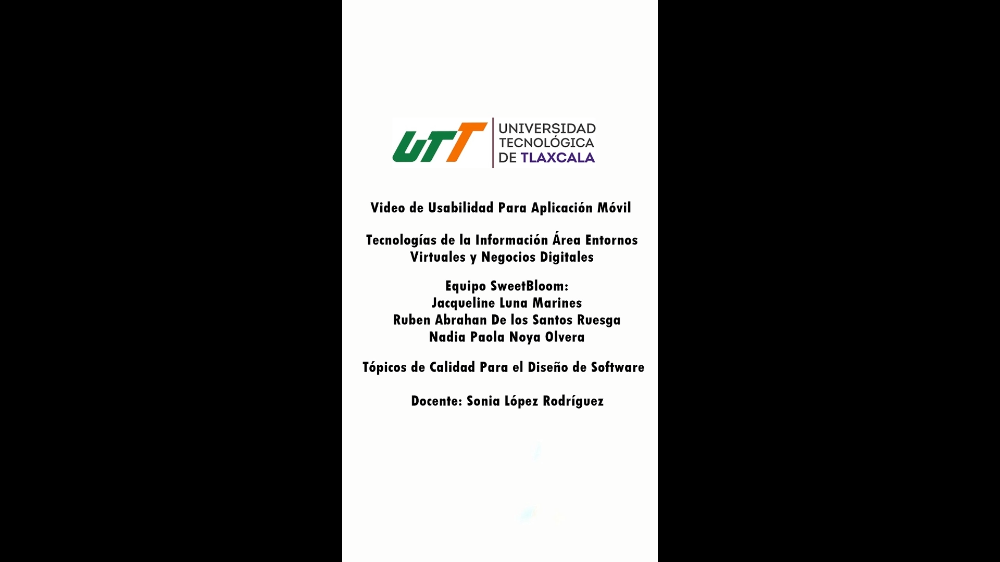
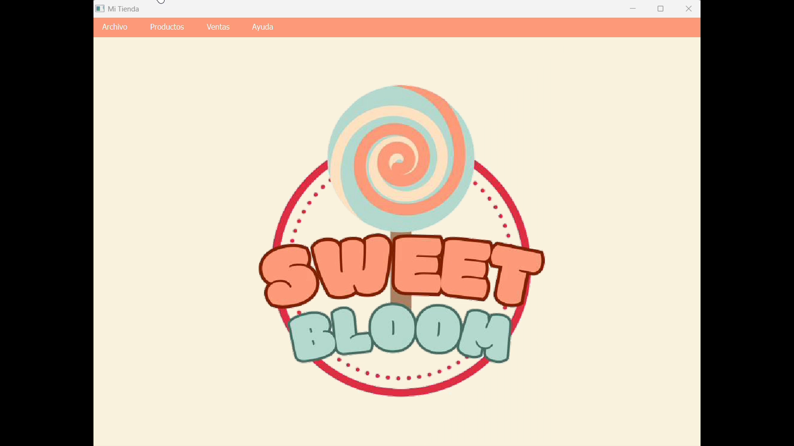
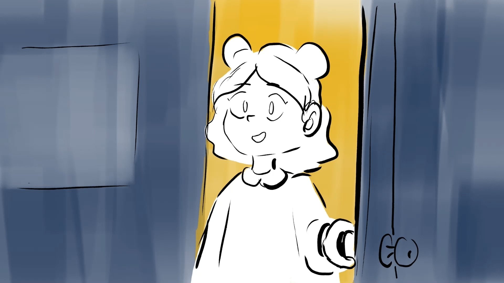
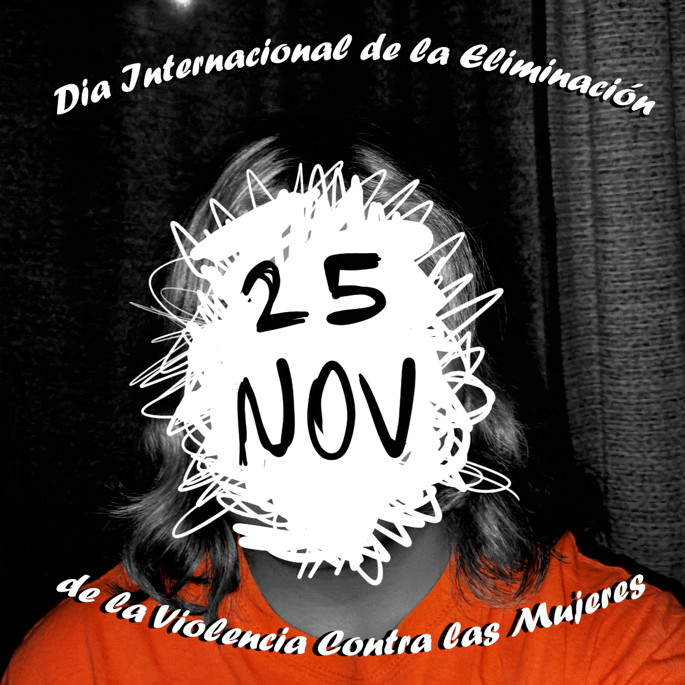
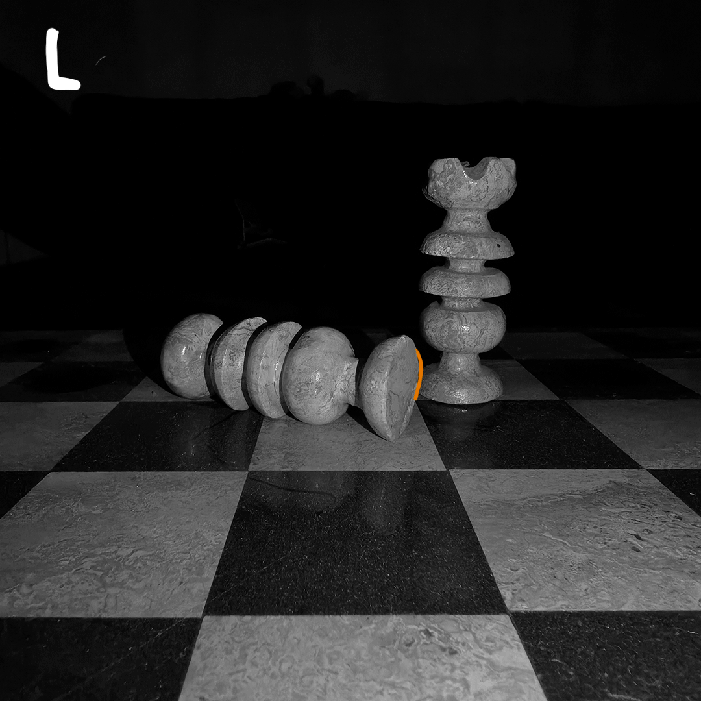
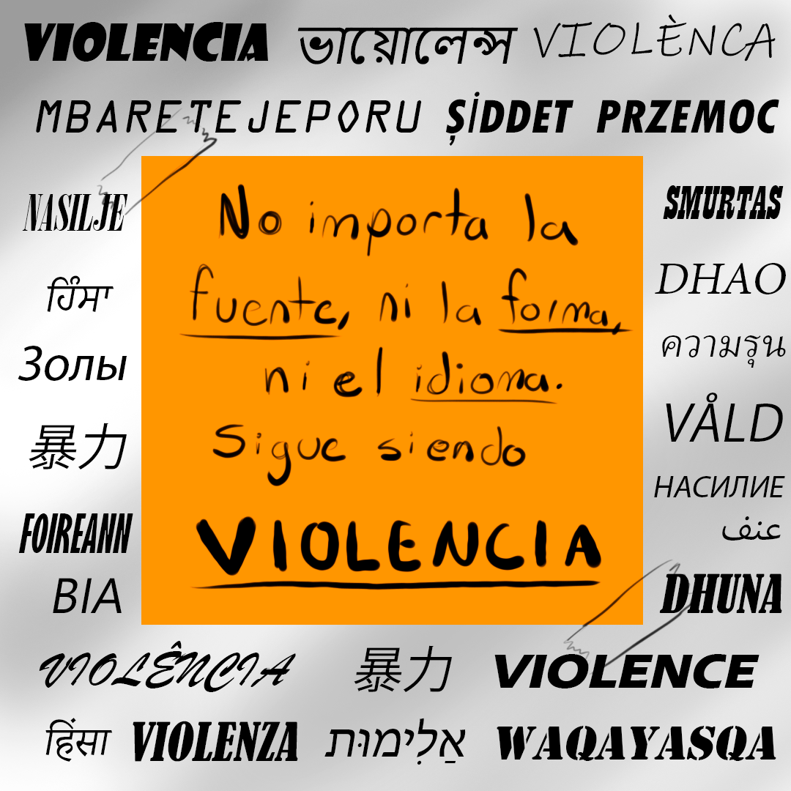
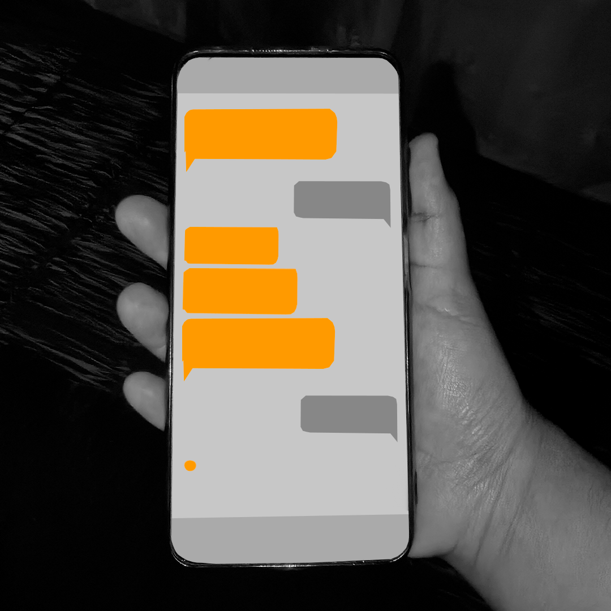

# NadiaOl15

Perfil profesional en Entornos Virtuales

<table>
<tr>
<td width="150">

</td>
<td>

<h1>Nadia Paola Noya Olvera</h1>
<h3>Desarrolladora Web | Diseñadora Digital | Especialidad en diseño y producción audiovisual | Animación digital</h3>

📍 Tlaxcala, México  
📧 nadia.noya.ol@gmail.com  
📱 241-164-8796  
🌐 <a href="https://linktr.ee/NadiaNoya">Redes sociales</a>

</td>
</tr>
</table>

---

---

## 👩‍💻 Sobre mí

Soy una desarrolladora web y diseñadora digital comprometida con el aprendizaje constante y la mejora continua. Me caracterizo por mi responsabilidad, disciplina y capacidad de adaptación a nuevos retos, buscando siempre desarrollar soluciones creativas, eficientes y orientadas a resultados.

Cuento con experiencia en desarrollo web, diseño digital y producción multimedia. Trabajo con tecnologías como HTML, CSS, Python, Bootstrap, Django, SQL y C#, gestionando bases de datos en PostgreSQL y XAMPP, además de desarrollar proyectos interactivos en Unity.

En el área creativa utilizo herramientas como Blender, Krita, IbisPaint, Photoshop, Adobe Premiere y Adobe Audition, combinando tecnología y diseño para crear experiencias digitales atractivas. También tengo conocimientos en mercadotecnia digital y gestión de redes sociales, aplicando estrategias de contenido y análisis de métricas como community manager.

Destaco por mi creatividad, trabajo en equipo, comunicación y perseverancia, buscando aportar valor en cada proyecto en el que participo.

---

## 🧑‍💼 Perfil Profesional

Desarrolladora y diseñadora digital con experiencia en creación de aplicaciones de realidad aumentada, realidad virtual, modelado 3D, animación 3D, animación 2D, ilustración digital, edición y producción de medios audiovisuales, aplicaciones web responsivas, manejo de bases de datos y diseño de interfaces atractivas. Enfocada en la estética y diseño de la experiencia del usuario.

---

# 🛠️ Tecnologías y Herramientas

## 🎨 Diseño y Multimedia

<table border="0" style="border:none;">
<tr align="center">

<td>
 
Blender
</td>

<td>
 
Unity
</td>

<td>
 
Photoshop
</td>

<td>
 
Premiere
</td>

<td>
 
Audition
</td>

<td>
 
FL Studio
</td>

<td>
 
Krita
</td>

<td>
 
Canva
</td>

</tr>
</table>

## 👨‍💻 Desarrollo

## 🗄️ Bases de Datos

<table border="0" style="border:none;">
<tr align="center">

<td>
 
PostgreSQL
</td>

<td>
 
MySQL
</td>

<td>
 
XAMPP
</td>

</tr>
</table>

## 📊 Herramientas Digitales

<table border="0" style="border:none;">
<tr align="center">

<td>
 
Word
</td>

<td>
 
Excel
</td>

<td>
 
PowerPoint
</td>

<td>
 
Google Docs
</td>

<td>
 
Google Sheets
</td>

</tr>
</table>

---

# ⭐ Habilidades personales

- Creatividad
- Trabajo en equipo
- Comunicación
- Resolución de problemas
- Adaptabilidad
- Pensamiento crítico
- Gestión de proyectos digitales

---

# 🌎 Idiomas

- Español — Nativo  
- Inglés — Intermedio/Alto

---

# 💼 Experiencia laboral

## 🏢 Excursiones Tlaxcalita la Bella  
**Community Manager** | 2024 - 2025  

- Manejo de publicidad pagada
- Interacción con seguidores
- Publicación de contenido

---

## 🏢 Excursiones Tlaxcalita la Bella  
**Diseñadora e ilustradora digital** | 2024 - Presente  

- Creación de ilustraciones
- Creación de contenido multimedia

---

# 🎓 Educación

**TSU en Tecnologías de la Información Área Entornos Virtuales y Negocios Digitales**  
Universidad Tecnológica de Tlaxcala | 2024 - Presente

---

# 🚀 Proyectos

### 🍬 Catálogo digital en aplicación móvil
Aplicación móvil de catálogo digital para una tienda de dulces tradicionales.

🎥 Video demostración  

---

### 🌐 Sistema de inventario para PC
Sistema de inventario para PC para la gestión de productos de una tienda de dulces tradicionales.

🎥 Video demostración  

---

### 🎞️ Cortometraje **"Lo Que No Se Dice"**
Cortometraje audiovisual para concientizar sobre la violencia en el noviazgo.

🎬 Ver cortometraje  

---

### 🎨 Cortometraje animado **"Mr. Cascabel"**
Cortometraje animado en 2D enfocado en la concientización sobre el bullying.

🎬 Ver cortometraje  

---

### 👩 Carteles digitales animados contra la violencia hacia la mujer

---

# 📜 Constancias y Certificaciones

**Curso: Desarrollador de Sitios Web Responsivos** | Abril, 2025
  
##

**Reconocimiento a creatividad en Rally TI-UTT** | Octubre, 2025 
  
##

**Segundo Congreso de Tecnología y Ciberseguridad** | Octubre, 2026 
  
##

**Taller: Animación Digital 3D Avanzada** | Octubre, 2025
  
##

**Presentación de cortometrajes por Primera Jornada Cultura de Paz** | Noviembre, 2025  
  
##

**Curso: SanaMente LibreMente: jóvenes por la paz y contra las adicciones** | Febrero, 2026 
  

---

# 📊 Estadísticas GitHub

